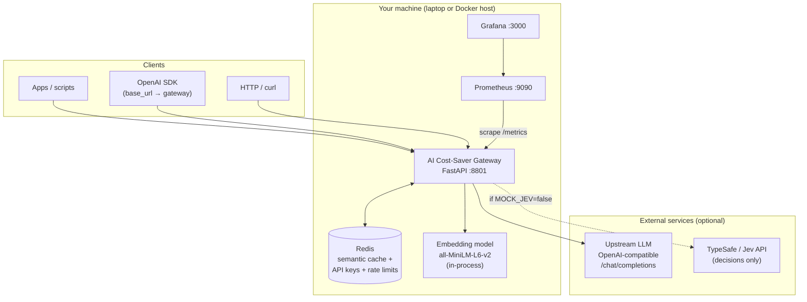
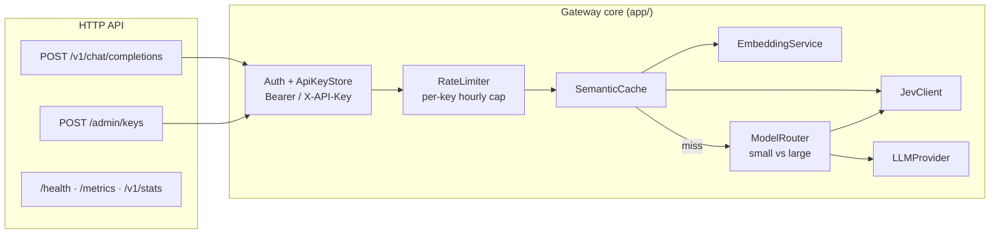
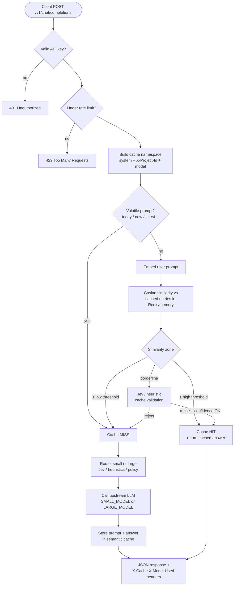
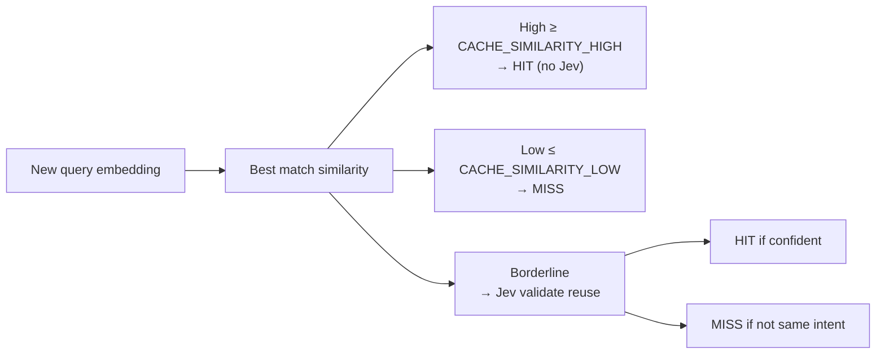
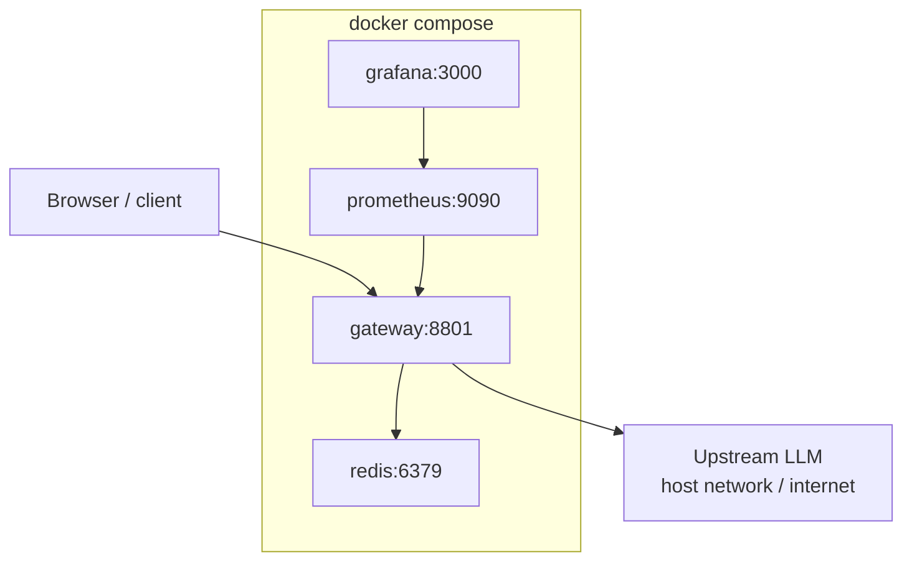

# AI Cost-Saver Gateway (with Jev)

Production-shaped OpenAI-compatible gateway that reduces LLM cost and latency using:

- Semantic caching (Redis + `all-MiniLM-L6-v2`)
- Three-zone cache policy (high / low / borderline → Jev)
- Jev (TypeSafe System One) for cache validation and model routing
- Confidence-aware fallbacks when Jev or Redis is unavailable
- Prometheus metrics and Grafana dashboards
- Per-API-key policies and rate limits

## Architecture

Jev does **not** generate answers. It returns structured decisions (reuse cache, route model, confidence).

### System context (who talks to whom)



### Gateway internal components



### Chat completion request flow



### Three-zone semantic cache policy



### Docker Compose deployment



| Layer | Technology | Role |
|-------|------------|------|
| API | FastAPI + Uvicorn | OpenAI-compatible surface, admin keys, metrics |
| Cache | Redis + embeddings | Similar prompts reuse answers; TTL and namespaces |
| Decisions | Jev (TypeSafe) + heuristics | Borderline cache safety; small/large routing |
| LLM | httpx → OpenAI-compatible API | Real answers on cache miss |
| Ops | Prometheus + Grafana | Latency, hit rate, routing, fallbacks |

Legacy one-line summary:

```text
Client → FastAPI Gateway → Auth/Rate limit → Embeddings → Semantic search
  → (high hit | low miss | borderline → Jev) → Small/Large LLM → cache store → metrics
```

## Quick start

```bash
cp .env.example .env
python -m venv .venv
source .venv/bin/activate   # Windows: .venv\Scripts\activate
pip install -r requirements.txt
uvicorn app.main:app --host 0.0.0.0 --port 8801
```

Default dev API key: `gw_dev_default_key`

## Run on your laptop

The gateway runs on your machine and sits **in front of** whatever LLM you choose. Your apps talk to `http://localhost:8801` (OpenAI-style API); the gateway handles caching, routing, and auth, then forwards misses to your upstream provider.

### 1. Prerequisites

- **Python 3.11+** (3.12 recommended)
- **Internet** on first run (downloads the embedding model `all-MiniLM-L6-v2`)
- **Redis** (recommended): persistent semantic cache across restarts  
  - Easiest: `docker run -d -p 6379:6379 redis/redis-stack-server:latest`  
  - Or skip Redis: the gateway still runs with in-memory cache (fine for trying the API)

### 2. Environment file

```bash
cp .env.example .env
```

When running **on the laptop** (not inside Docker Compose), set:

```env
REDIS_URL=redis://localhost:6379/0
```

(`.env.example` uses `redis://redis:6379/0`, which only works as the Docker service name.)

### 3. Install and start

**macOS / Linux**

```bash
python -m venv .venv
source .venv/bin/activate
pip install -r requirements.txt
uvicorn app.main:app --host 0.0.0.0 --port 8801
```

**Windows (PowerShell)**

```powershell
python -m venv .venv
.\.venv\Scripts\Activate.ps1
pip install -r requirements.txt
uvicorn app.main:app --host 0.0.0.0 --port 8801
```

Open http://localhost:8801/health — you should see `status: ok`. Use API key `gw_dev_default_key` (created automatically on first startup).

### 4. Try a request

```bash
curl -X POST http://localhost:8801/v1/chat/completions \
  -H "Authorization: Bearer gw_dev_default_key" \
  -H "Content-Type: application/json" \
  -d '{"model":"gpt-4o-mini","messages":[{"role":"user","content":"Hello"}]}'
```

With `MOCK_LLM=true` (default), responses are local mocks — no paid API needed. Turn on a real LLM using the section below.

## Use with any LLM (OpenAI-compatible)

Upstream calls use the **OpenAI Chat Completions** shape: `POST {OPENAI_BASE_URL}/chat/completions` with `Authorization: Bearer {OPENAI_API_KEY}`. Any provider that exposes that API works (cloud APIs, local runners, proxies).

In `.env`:

```env
MOCK_LLM=false
OPENAI_API_KEY=your-upstream-key-or-placeholder
OPENAI_BASE_URL=https://api.openai.com/v1
SMALL_MODEL=gpt-4o-mini
LARGE_MODEL=gpt-4o
```

- **`SMALL_MODEL` / `LARGE_MODEL`**: The gateway routes “simple” traffic to `SMALL_MODEL` and “complex” traffic to `LARGE_MODEL` (Jev/heuristics). Set these to **real model IDs** your provider accepts.
- **`OPENAI_API_KEY`**: Required when `MOCK_LLM=false`. Some local servers accept any non-empty string (e.g. `ollama`).

### Point your apps at the gateway

Use the gateway as if it were OpenAI:

| Setting | Value |
|---------|--------|
| Base URL | `http://localhost:8801/v1` |
| API key | `gw_dev_default_key` (or a key from `/admin/keys`) |

**Python (OpenAI SDK)**

```python
from openai import OpenAI

client = OpenAI(
    base_url="http://localhost:8801/v1",
    api_key="gw_dev_default_key",
)
response = client.chat.completions.create(
    model="gpt-4o-mini",  # optional; gateway may override via routing
    messages=[{"role": "user", "content": "Summarize semantic caching in one sentence."}],
)
print(response.choices[0].message.content)
```

**curl / any HTTP client** — same as Quick start; only the upstream `.env` changes when you switch providers.

### Example provider setups

Adjust `OPENAI_BASE_URL`, `OPENAI_API_KEY`, and model names to match each service.

| Provider | `OPENAI_BASE_URL` | Models (`SMALL_MODEL` / `LARGE_MODEL`) | Notes |
|----------|-------------------|----------------------------------------|--------|
| **OpenAI** | `https://api.openai.com/v1` | e.g. `gpt-4o-mini` / `gpt-4o` | Use your platform API key |
| **OpenRouter** | `https://openrouter.ai/api/v1` | e.g. `openai/gpt-4o-mini` / `openai/gpt-4o` | OpenRouter API key |
| **Groq** | `https://api.groq.com/openai/v1` | e.g. `llama-3.1-8b-instant` / `llama-3.3-70b-versatile` | Groq API key |
| **Ollama** (local) | `http://localhost:11434/v1` | e.g. `llama3.2` / `llama3.1` | Run `ollama serve`; key can be `ollama` |
| **LM Studio** (local) | `http://localhost:1234/v1` | Names shown in LM Studio | Enable local server in LM Studio |
| **Azure OpenAI** | `https://{resource}.openai.azure.com/openai/deployments/{deployment}/` | Your deployment names | Often needs deployment-specific URLs; use the deployment name as `model` if required by your endpoint |

After changing `.env`, restart `uvicorn`. Check `/health`: `mock_llm` should be `false` when a real key is set and mocks are disabled.

### Force a specific model tier per API key

Create a key with `routing_mode` so all requests use one upstream model:

```bash
curl -X POST http://localhost:8801/admin/keys \
  -H "X-Admin-Secret: change-me-admin-secret" \
  -H "Content-Type: application/json" \
  -d '{"name":"local-only","policy":{"routing_mode":"small","cache_enabled":true}}'
```

Use the returned `api_key` in `Authorization: Bearer ...`. With `routing_mode: "small"`, upstream calls always use `SMALL_MODEL`.

### Jev on a laptop

Jev (TypeSafe) is optional for cache validation and routing. Defaults:

- `MOCK_JEV=true` — no TypeSafe account; heuristics handle borderline cache and routing.
- For live Jev: set `TYPESAFE_API_KEY`, `MOCK_JEV=false`, and keep `JEV_ENABLED=true`.

### Docker Compose (gateway + Redis + Prometheus + Grafana)

```bash
docker compose up --build
```

- Gateway: http://localhost:8801
- Grafana: http://localhost:3000 (admin / admin)
- Prometheus: http://localhost:9090

## API

### Chat completions

`POST /v1/chat/completions` (OpenAI-compatible)

Headers:

- `Authorization: Bearer <api_key>`
- `X-Project-Id` (optional cache namespace)

Response headers:

- `X-Cache: HIT|MISS`
- `X-Model-Used: small|large`
- `X-Route-Source: jev|heuristic|policy|fallback`
- `X-Route-Confidence: 0.94`
- `X-Jev-Confidence` (borderline cache decisions)

### Admin API keys

```bash
curl -X POST http://localhost:8801/admin/keys \
  -H "X-Admin-Secret: change-me-admin-secret" \
  -H "Content-Type: application/json" \
  -d '{"name":"team-a","policy":{"cache_enabled":true,"jev_enabled":true,"routing_mode":"auto"}}'
```

Per-key policy fields:

- `cache_enabled`
- `similarity_threshold`
- `jev_enabled`
- `jev_confidence_threshold`
- `routing_mode` (`auto`, `small`, `large`)
- `rate_limit_per_hour`

## Configuration

See `.env.example`.

| Variable | Purpose |
|----------|---------|
| `OPENAI_API_KEY` | Bearer token for upstream LLM |
| `OPENAI_BASE_URL` | Upstream base URL (any OpenAI-compatible `/v1`) |
| `SMALL_MODEL` / `LARGE_MODEL` | Model IDs sent upstream for small/large routing |
| `MOCK_LLM` | Local mock responses when true |
| `TYPESAFE_API_KEY` | Live Jev / TypeSafe API |
| `MOCK_JEV` | Deterministic Jev fallback when true |
| `CACHE_SIMILARITY_HIGH` / `LOW` | Three-zone thresholds |
| `REDIS_URL` | Semantic cache backend (`localhost` on laptop, `redis` in Compose) |

## Cache safety

- Namespace includes system prompt, project ID, and model
- TTL on cache entries
- Volatile prompts (`today`, `now`, `latest`, …) skip cache
- Borderline similarity routed to Jev with confidence threshold

## Benchmarks

```bash
python benchmark/benchmark_jev.py
python benchmark/run_benchmark.py --base-url http://127.0.0.1:8801
```

`run_benchmark.py` exercises duplicates, paraphrases, similar-but-different prompts, simple/complex, and volatile queries.

## Tests

```bash
pytest -q
```

## Demo flow

1. First request → `X-Cache: MISS`, routed small/large, answer stored
2. Rephrased question (borderline) → Jev validates → `X-Cache: HIT`
3. Similar but different intent → Jev rejects reuse → LLM called
4. Complex prompt → Jev routes to large model

Open Grafana to inspect cache hit rate, cost saved, latency, Jev confidence, and fallback rate.
